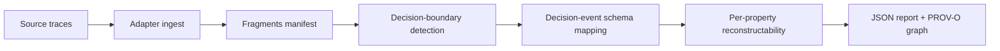

# Reconstruction Architecture

Decision Trace Reconstructor applies a deterministic six-stage pipeline to a fragments manifest.

1. **Fragment collection** — gather typed evidence pointers from the ingest output.
2. **Temporal ordering** — sort by timestamps and parent-trace edges.
3. **Chain assembly** — link fragments into candidate decision chains.
4. **Decision-boundary detection** — partition chains into discrete decision units using state-change magnitude, tool-call boundaries, human intervention, and policy-constraint activation.
5. **Decision-event schema mapping** — project each decision unit onto the canonical 7-property schema.
6. **Feasibility report generation** — classify each property, name the evidence gap, and emit the reconstructability tensor.

LLM internal reasoning is never reconstructed. The reconstructor substitutes the authorization envelope: inputs available, constraints active, outputs possible, and the explicit fact that this is a substitution rather than recovered reasoning.

The pipeline is deterministic given the fragments manifest.

## Related

- [Reports and output artifacts](reports.md)
- [Development](development.md)
